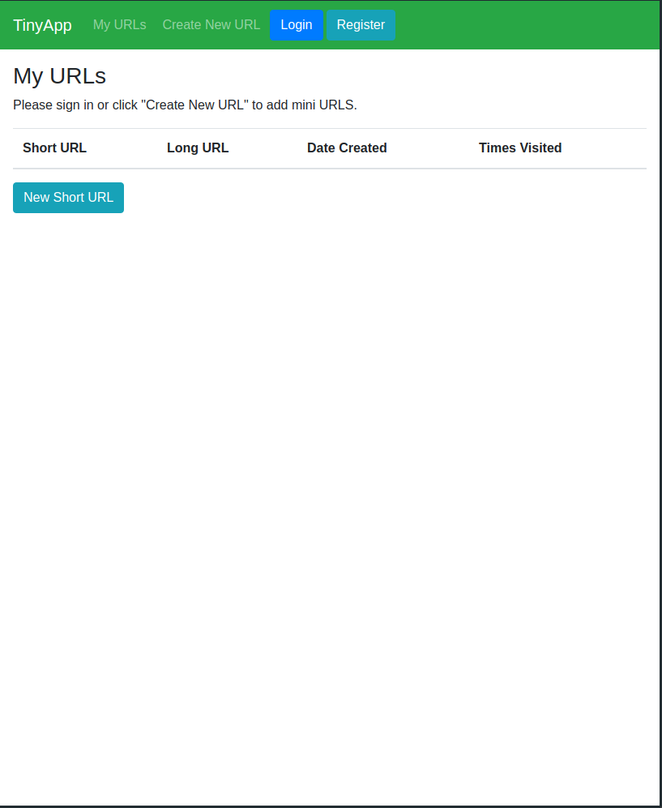
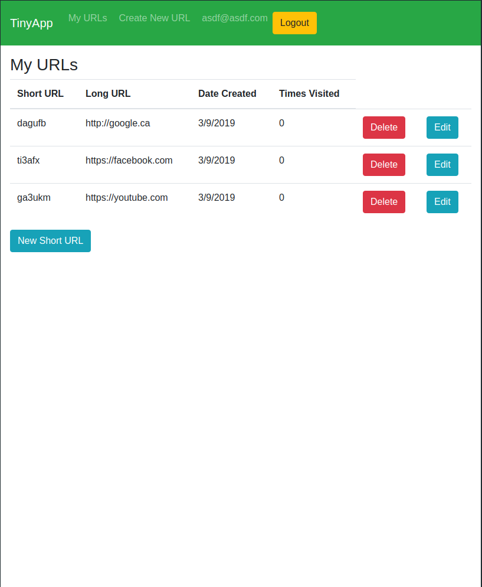
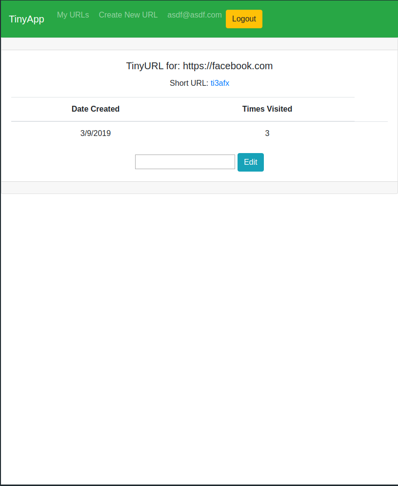

# TinyApp Project

TinyApp is a full stack web application built with Node and Express that allows users to shorten long URLs (à la bit.ly).

## Final Product

  

## Dependencies

- Node.js
- Express
- EJS
- bcrypt
- body-parser
- cookie-session

## Getting Started

- Install all dependencies (using the `npm install` command).
- Run the development web server using the `node express_server.js` command.

## Functionality

Basic functionality is shortening and storing of URLs.  The URLs are tied to individual accounts, so anyone can use a redirect link, but only the creators can edit or delete them.  As a result, registration is required to create URLs.

The URLs will keep track of when they were created, and how many times they have been accessed, ticks of which can be viewed on the users index page, or on the edit page of that URL.